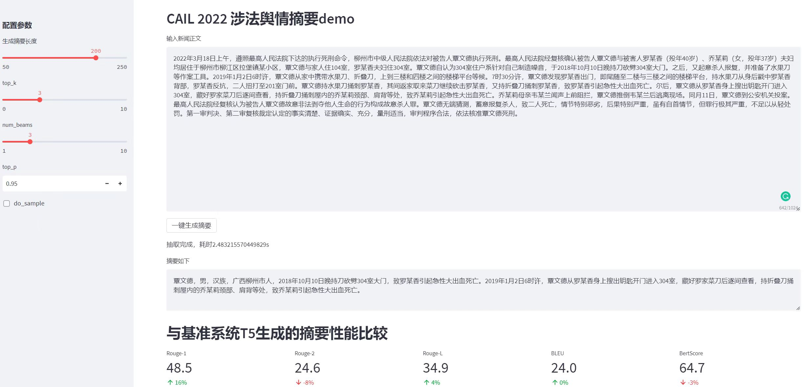
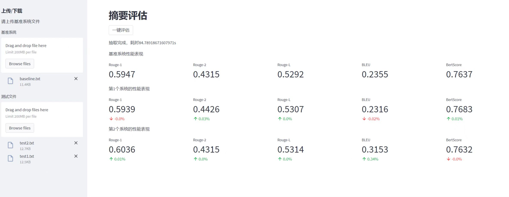

# 1. Introduction

This is a demo for streamlit of text generation (summarization based on T5).

There are two parts: online generation and online evaluation.

# 2. Architecture
The architecture of the project is following:

## 2.1 filefold
-data # Here are some results you want to evaluate.

-module # This is a path where your custom models are.

-t5_pegasus_torch # This is a path where the pre-trained model is.
Default Chinese T5 model you can find in [T5-pegasus-torch](https://github.com/renmada/t5-pegasus-pytorch).

## 2.2 file
--app.py # This is an entry of the demo of online generating the result by the T5 model.

--app_eval.py # This is an entry of the demo of online evaluating the result you want to compare with.

--e2e.py # This is the file that contains the inference of the model.

--evaluate.py # This file contains the evaluator of rouge, bleu, and bertscore.

# 3. How to run
There are three steps.

First, code the homepage (app.py, app_eval.py or any file likes it.)\

Second, install the requirements.

Please be careful the version of package which may not suit your machine and you should use the correct version instead of them.
```commandline
pip install -r requirements.txt 
```
Third, run the server.

If you want to online generate the summarization.
```commandline
streamlit run app.py
```
If you want to online evaluate the result.
```commandline
streamlit run app_eval.py
```


# 4. Example View
This is the view of app.py


This is the view of app_eval.py


# 5. If you want to revise it
This project is a demo that can not reflect the model's actual performance.

If you want to revise it for your model, please refer to [the official website of streamlit](https://streamlit.io/) and change the corresponding part of this project.

Here is a [Chinese introduction blog](https://fjiang.blog.csdn.net/article/details/128386021) about streamlit; you can look for some valuable suggestions.

This project is inspired by [GPT2-newstitle](https://github.com/liucongg/GPT2-NewsTitle).

